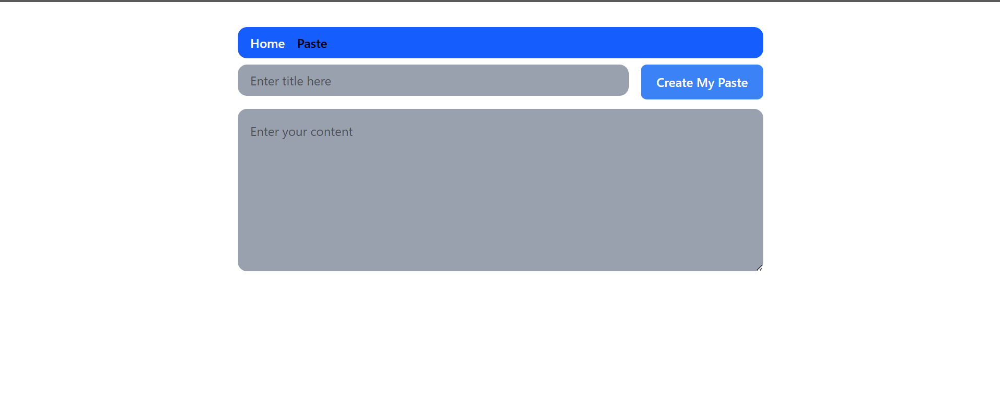
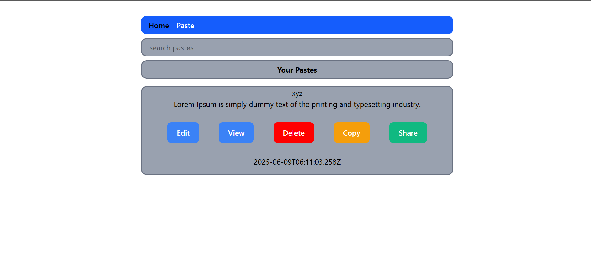

# 📋 Paste App

A simple and minimal **Paste Manager App** built using **React** and **Redux**, where users can:
- Create pastes
- View, edit, delete, and share them
- Search pastes in real-time
- Copy content to clipboard easily

---

## 🚀 Features

- ✅ Create and manage multiple pastes
- 🔍 Real-time search filter
- ✂️ Edit and delete existing pastes
- 📤 Copy content with a single click
- 🔗 Share paste links (using Web Share API / clipboard)
- 📁 Local Redux store management
- 💾 Data is stored in browser **Local Storage** for persistence

---

## 🧑‍💻 Tech Stack

- React
- Redux Toolkit
- Tailwind CSS
- React Router
- Toast Notifications (`react-hot-toast`)

---

## 📸 Screenshot

Paste App Screenshot :-

---

## 🛠️ How to Run the Project Locally

1. **Clone the repository:**

    git clone https://github.com/your-username/paste-app.git  
    cd paste-app

2. **Install dependencies:**

    npm install

3. **Start the development server:**

    npm run dev

4. **Visit in browser:**
